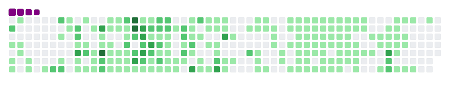

<h1 align="center">
   
</h1>

<h3 align="center">A passionate frontend software developer from Bangladesh 🇧🇩</h3>
 

:wave: Hello, Myself Munmun Islam Mim hailing from Dhaka, Bangladesh. I'm an undergrad student of CSE at The University of Asia Pacific.

- ✍️ I’m currently working on **self improvement**.

- 📚 I’m currently learning **Machine Learning**.

- 💻 All of my projects are available at [https://github.com/Munmun-Mim?tab=repositories](https://github.com/Munmun-Mim?tab=repositories)

- 📧 How to reach me **20101041@uap-bd.edu**

- 😁 Fun fact **I could be lured into a kidnapper's car by food**.

 

 

<h2 align="center">Connect with me</h2>

<h2 align="center">Languages and Tools</h2>
 

  &nbsp;
  &nbsp;
  &nbsp;
  &nbsp;
  &nbsp;
  &nbsp;
  &nbsp;
  &nbsp;
  &nbsp;
  &nbsp;
  &nbsp;
   
  &nbsp;
  &nbsp;
  &nbsp;
  &nbsp;
  &nbsp;
  &nbsp;
  &nbsp;
  &nbsp;
  &nbsp;
  &nbsp;
  &nbsp;

  <h2>My Contributions</h2>
  
  

<h2 align="center">Stats</h2>
 

  
  
   
  

 

<h1 align="center">
    
</h1>
